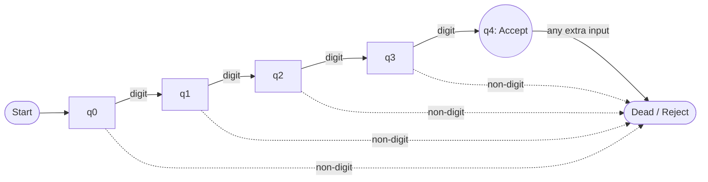

# Four-Digit PIN DFA

The automaton accepts exactly four ASCII digits. A non-digit or a fifth digit transitions to the dead state. Leading zeroes are valid.

```mermaid
flowchart LR
    S([Start]) --> q0[q0]
    q0 -- digit --> q1[q1]
    q1 -- digit --> q2[q2]
    q2 -- digit --> q3[q3]
    q3 -- digit --> q4((q4: Accept))
    q4 -- any extra input --> D([Dead / Reject])
    q0 -. non-digit .-> D
    q1 -. non-digit .-> D
    q2 -. non-digit .-> D
    q3 -. non-digit .-> D
```
